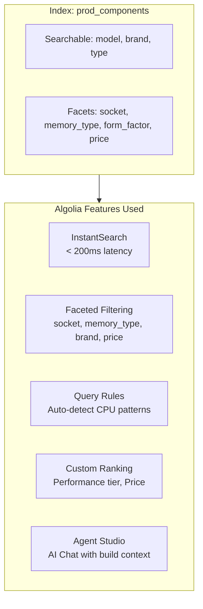
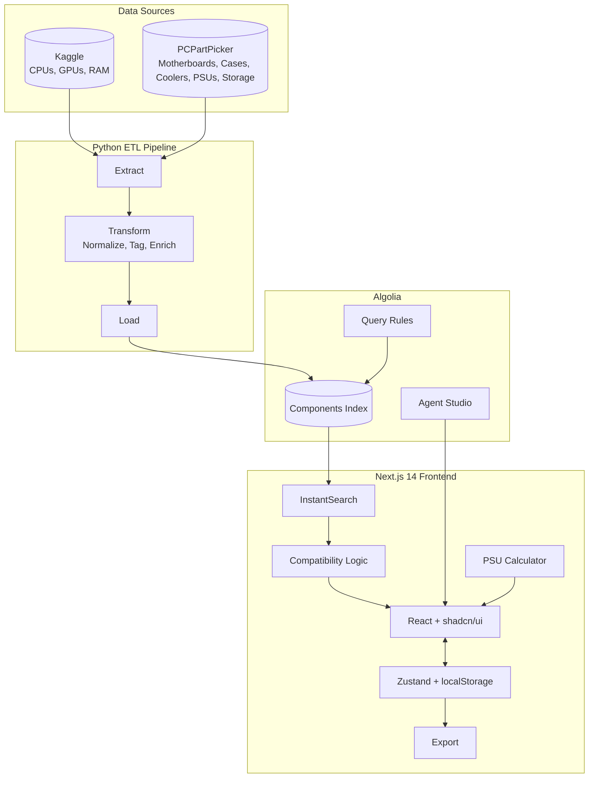

# Spec-Logic Technical Architecture Diagrams

## Diagram 1: Algolia Features

**Show at:** Script lines 53-73 (Algolia features section)
> "Let me highlight the specific Algolia features powering this experience..."

---

## Diagram 2: System Architecture

**Show at:** Script lines 77-101 (Technical architecture section)
> "Now a quick overview of the technical architecture and how we built the data layer..."

---

## Quick Reference: When to Show Each Diagram

| Diagram | Script Section | Timestamp (approx) |
|---------|---------------|-------------------|
| **1. Algolia Features** | Algolia features | ~4:00-5:00 |
| **2. System Architecture** | Technical architecture | ~5:00-6:00 |
